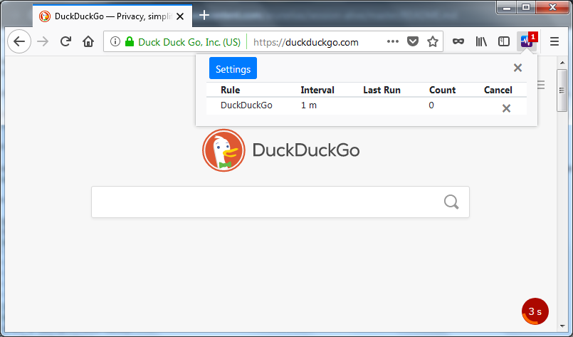
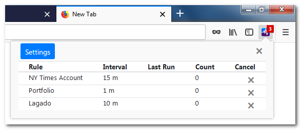
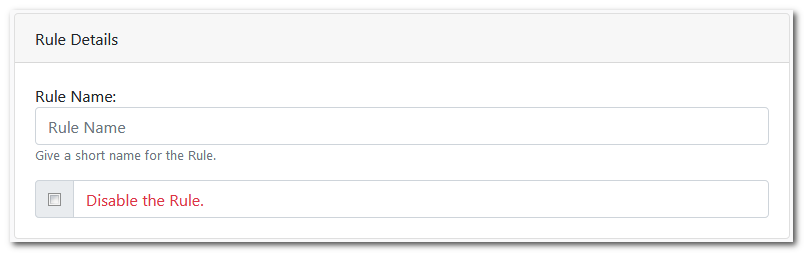
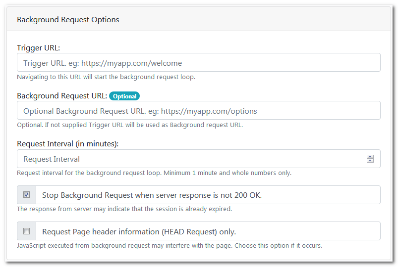
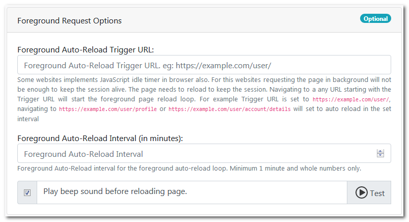
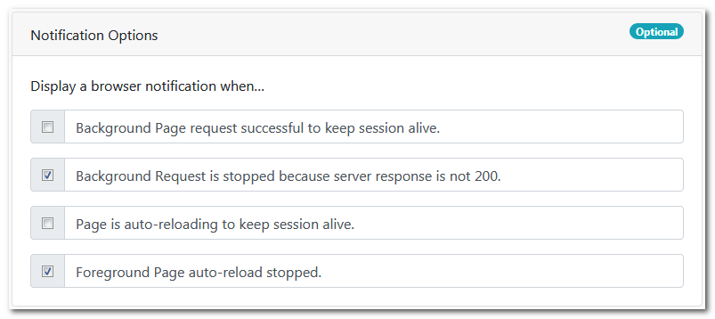
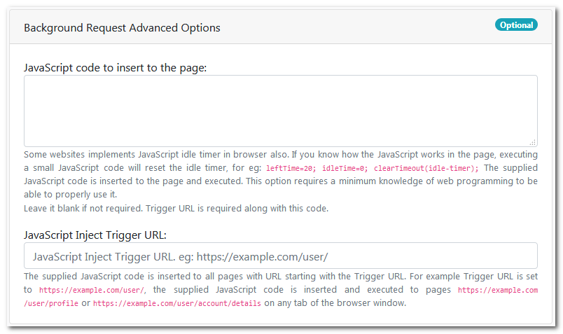

<!--img src="./readme-resources/wip.jpg" style="width: 350px; height: 345px;"-->

# Session Alive
This add-on is used to keep the session alive for any website. Install and forget the session timeout messages.

Install from the [Add-ons for Firefox](https://addons.mozilla.org/en-US/firefox/addon/keep-session-alive/) website.

> Original idea credits to [Dmitri Snytkine](https://github.com/snytkine) for his wonderful chrome add-on [Staying Alive](https://chrome.google.com/webstore/detail/staying-alive/lhobbakbeomfcgjallalccfhfcgleinm)

### Purpose

Session Timeout is great functionality for Production websites, but not for Development and Testing. There are great add-ons for reloading the pages, but what about a "fit and forget it" solution?

### Contents

* [Quick start](#quick-start)
* [Main view](#main-view-information-pop-up)
* [Rules](#rules)
  * [Rules Details](#rule-details)
  * [Background Request Options](#background-request-options)
  * [Foreground Request Options](#foreground-request-options)
  * [Notification Options](#notification-options)
  * [Background Request Advanced Options](#background-request-advanced-options)
* [Installation](#installation)
* [Browser compatibility](#browser-compatibility)
* [What's next](#whats-next)
* [Credits](#credits)
* [Info](#info)

## Quick start

Get started creating a new **[Foreground Auto-Reload Rule](#foreground-request-options)** with 1 minute interval.


Navigate to the Trigger URL in a new tab.


--------------

## Main view (Information Pop-up)


The *Main view* is the informational page of the add-on where you can view the currently running *Rules*. Click the Settings button to open the Session Alive Settings page. 

- **Running Rules information**
  Currently running rules are displayed in a tabular format. The Rule Name, Set interval, Last Run time and Total Run Count is displayed. The Running rule can be canceled using the _Cancel_ button.

> The rule will start running again if the user navigates to the _Trigger URL_ after canceling the rule. To prevent this, the rule can be disabled or deleted.

## Rules

A *Rule* should either contain *Background Request* or a *Foreground Request* with following items:

 1. Rule Name
 2. Trigger URL
 3. Request Interval

#### Rule Details


The Rule Name can be set here. Give a short name to identify the rule. The rule can be set as disabled using the _Disable the Rule_ check-box.

> If the rule is running, changes made are applied when the rule is restarted. To restart the rule, cancel the running rule and navigate to the _Trigger URL_ again to restart the rule.

#### Background Request Options


The *Background Request Rule* is used to keep the session alive by requesting a page in the background. 
The page reload is not required as the process happens in the background using AJAX requests. 
The following options are available in the Background Request Options:

- **Trigger URL:**  
  Navigating to the _Trigger URL_ will start the background request loop. The background request URL is requested at the set _Request Interval_. 

- **Background Request URL: (Optional)**  
  If background request URL is different from the _Trigger URL_, the same can be set here. If this is not supplied _Trigger URL_ will be used as the Background request URL.

- **Request Interval (in minutes):** 
  The background request URL is requested in a loop at the set _Request Interval_ time. The minimum _Request Interval_ is 1 minute, and only whole numbers can be set here.

- **Stop Background Request when server response is not 200 OK:** 
  The server response of the background request is analyzed and the loop can be stopped if the server response is not a [200 OK](https://tools.ietf.org/html/rfc2616#section-10.2.1) status. 
  The response from server may indicate that the session is already expired.

- **Request Page header information (HEAD Request) only:** 
  When background request fetches the URL, JavaScript code in the page is also executed. This may interfere with the page user is currently working with. To prevent this, [HEAD](https://tools.ietf.org/html/rfc2616#section-9.4) request can be opted, which will fetch only the page header information only.

> The *Background Request Rule* will not be enough to keep the session alive, if websites implements JavaScript idle timer in the browser itself. 
> Use Advanced options or Foreground Auto-Reload options in this scenario.

#### Foreground Request Options


The *Foreground Request Rule* is used to keep the session alive by auto-reloading current page in the browser. 
The following options are available in the Foreground Request Options:

- **Foreground Auto-Reload Trigger URL:**  
  Navigating to any URL starting with the _Trigger URL_ will start the foreground page reload loop. For example if _Trigger URL_ is set to `https://example.com/user/`, navigating to `https://example.com/user/profile` or `https://example.com/user/account/details` will set to auto reload in the set _Request Interval_.

- **Foreground Auto-Reload Interval (in minutes):** 
  The page will be auto-reloading in the set _Request Interval_ time. The minimum _Request Interval_ is 1 minute, and only whole numbers can be set here.

- **Play beep sound before reloading page:** 
  Play a short beep sound 10 seconds before page reloading automatically. The beep sound can be tested using the _Test_ button.

> A count-down timer is displayed in the web page 30 seconds before before page reloading automatically.
> Any unsaved data in the page may be lost when the page reloads automatically.
> Browser will show a warning dialog if any form submission is repeated by the page reload.
> Please note that the count-down timer will **not** be displayed for web pages that uses [FRAMESET element](https://www.w3.org/TR/html401/present/frames.html). However, page reloads automatically at the set interval.

#### Notification Options


Browser Notifications can be set here for the following conditions:

- **Background Page request successful to keep session alive:**  
- **Background Request is stopped because server response is not 200:**  
- **Page is auto-reloading to keep session alive:**  
- **Foreground Page auto-reload stopped:**  

#### Background Request Advanced Options


These options can be useful when *Background Request Rule* is not enough to keep the session alive. The *Background Request Rule* alone is not enough when websites implements JavaScript idle timer in the browser itself. 

> This option requires a minimum knowledge of web programming to be able to properly use it.

The following options are available in the Foreground Request Options:

- **JavaScript code to insert to the page:**  
  The supplied JavaScript code is inserted to the page and executed. _Trigger URL_ is required along with this code.
> The code is executed in all the frames of the page, provided that the [Same-origin policy](https://developer.mozilla.org/en-US/docs/Web/Security/Same-origin_policy) is satisfied.
- **JavaScript Inject Trigger URL:**  
  The supplied JavaScript code is inserted to any URL starting with the _Trigger URL_. For example if _Trigger URL_ is set to `https://example.com/user/`, the supplied JavaScript code is inserted and executed to pages `https://example.com/user/profile` or `https://example.com/user/account/details` on any tab of the browser window.

###### Example
For example: a web site uses [jQuery session timeout](https://plugins.jquery.com/sessionTimeout/) plug-in for session timeout, setting the following JavaScript code will set the session timeout as 200 minutes.
```javascript
    $.sessionTimeout({warnAfter: 9e6,redirAfter: 12e6});true;
```
> Keep a return value or _true;_ in the javascript code

## Installation

- Download the repository and extract.
- Go to [`about:debugging`](https://developer.mozilla.org/en-US/docs/Tools/about:debugging) and load it as temporary extension

## Browser compatibility:


## What's next 

TODO

## Credits

- [Dmitri Snytkine](https://github.com/snytkine) for his wonderful chrome add-on [Staying Alive](https://chrome.google.com/webstore/detail/staying-alive/lhobbakbeomfcgjallalccfhfcgleinm)
- Icons by [Firefox Photon icons](https://design.firefox.com/icons/viewer/)
- [Christian Kaindl](https://github.com/christiankaindl) for Translate an HTML page with the i18n API

## Info

*Session Alive* is written and maintained by [Arun](https://github.com/arunelias)  
License: [MIT](https://github.com/arunelias/Session-Alive/blob/master/LICENSE)
